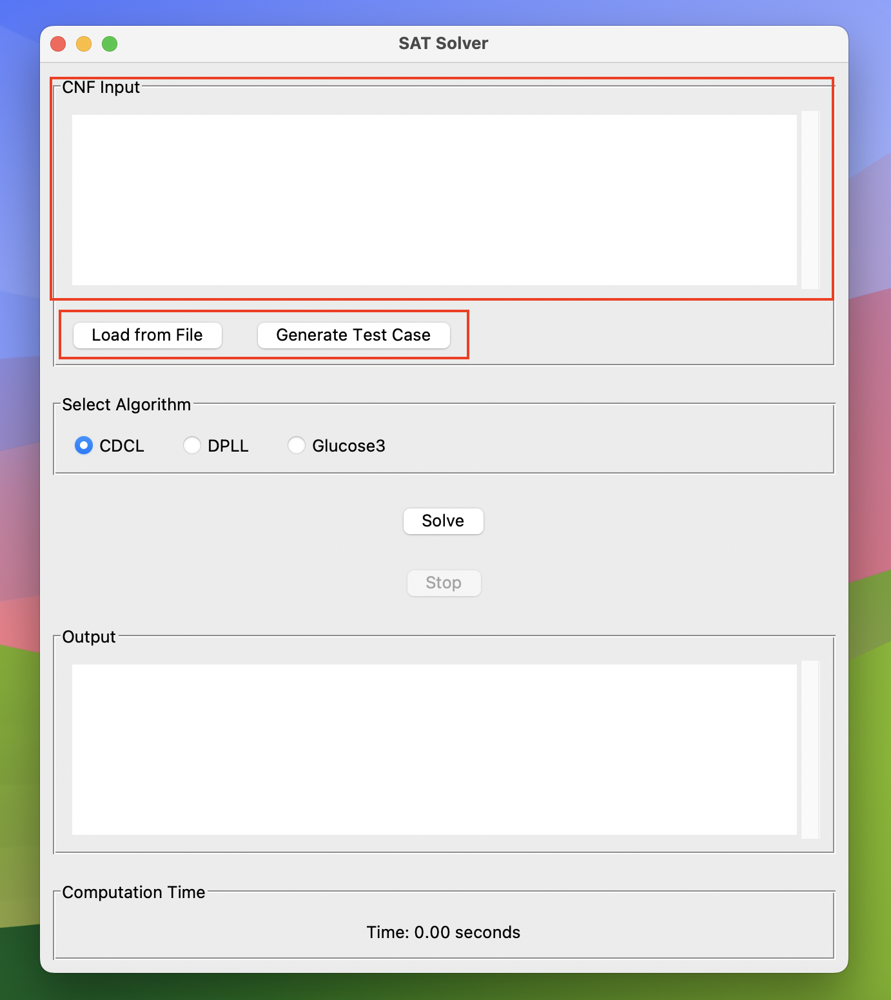
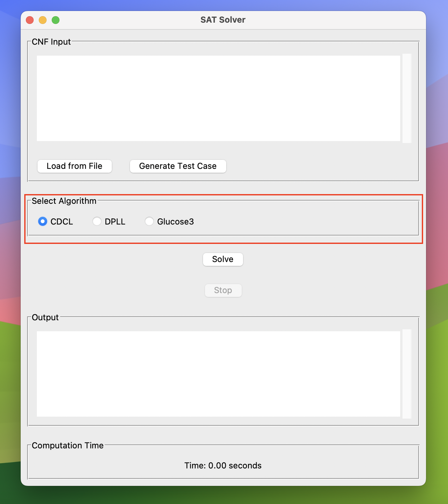
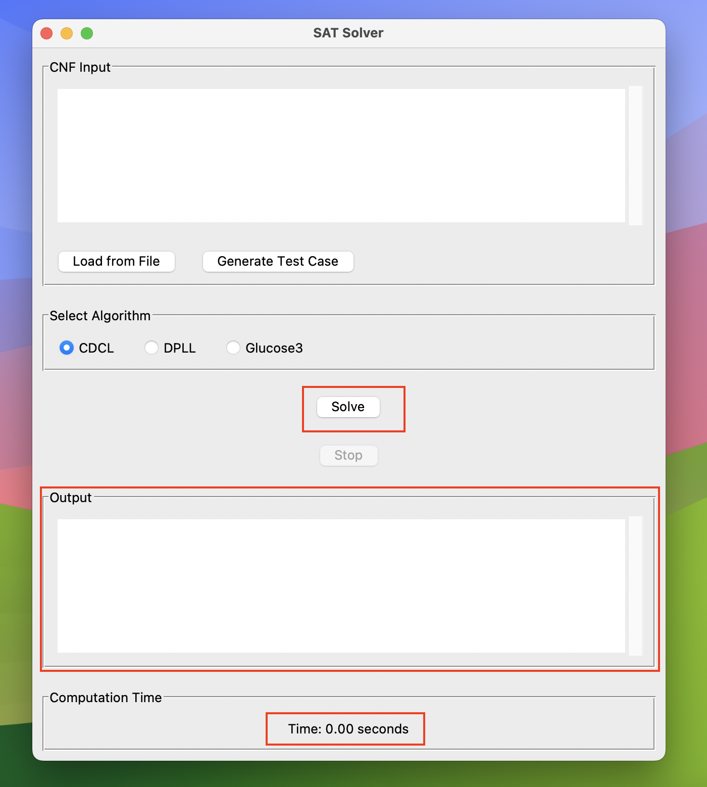

# SAT Solver

## Kratek opis problema SAT

SAT (Boolean satisfiability problem) je problem določanja, ali obstaja način za dodelitev vrednosti True/False spremenljivkam v logični formuli tako, da celotna formula postane True. Ta problem je ključen v računalništvu, saj je prvi problem, za katerega je bilo dokazano, da je NP-poln.

## Kratek opis rešitev

### DPLL (Davis-Putnam-Logemann-Loveland) algoritem

DPLL je algoritem za reševanje SAT problema, ki temelji na rekurzivnem razcepu in zmanjšanju problema. Algoritem uporablja tehnike, kot so enotna propagacija (unit propagation) in heuristika čistega literala (pure literal heuristic), za poenostavitev formule, preden se rekurzivno razcepi na podprobleme. Implementirana je tudi heuristika za pametnejšo izbiro literala VSIDS.

### CDCL (Conflict-Driven Clause Learning) algoritem

CDCL je napredna različica DPLL algoritma, ki vključuje učenje klavzul na podlagi konfliktov, da bi preprečil ponavljanje istih napak. CDCL uporablja napredne heuristike za izbiro spremenljivk in tehnike, kot so backjumping, da se učinkovito premika po iskalnem prostoru. Implementirani so tudi pogosti napredni pristopi za učinkovitejše delovanje kot so:
- Two watched literal (optimizacija prostora in časa)
- VSIDS (optimizacija časa)
- Brisanje naučenih klavzul (optimizacija prostora in časa) 

## Struktura programa

- `main.py`: Glavni program za zagon SAT solverja.
- `src/`:
  - `gui/`: Grafični uporabniški vmesnik za SAT solver.
    - `sat_solver_gui.py`
  - `test_case_generator/`: Generiranje testnih primerov za SAT solver.
    - `test_case_generator.py`
  - `cdcl_solver.py`: Implementacija CDCL solverja.
  - `clause.py`: Definicija razreda Clause.
  - `dpll_solver.py`: Implementacija DPLL solverja.
  - `literal.py`: Definicija razreda Literal.
  - `trail.py`: Definicija razreda Trail.
  - `two_watched_literals.py`: Implementacija optimizacije z dvema nadzorovanima literala.
  - `variables.py`: Definicija razreda Variables.
- `test_cases/`:
  - `benchmark_problems/`: Benchmark problemi za testiranje solverja.
  - `random_problems/`: Naključno generirani problemi za testiranje solverja.
- `tests/`: Unit testi za posamezne razrede
  - `test_cdcl_solver.py`
  - `test_clause.py`
  - `test_dpll_solver.py`
  - `test_literal.py`
  - `test_trail.py`
  - `test_two_watched_literals.py`
  - `test_variables.py`

## Navodila za zagon programa

Za zagon SAT solverja, zaženite `main.py`:

```bash
python main.py
```

## Uporaba programa

### 1. Vnos SAT problema

V začetnem delu programa lahko vnesete SAT problem v CNF obliki. SAT problem lahko vnesete ročno, naložite iz datoteke, ali pa zgenerirate naključni primer.



### 2. Izbira metode reševanja

V drugem delu izberete želeno metodo reševanja. Program ponuja dve metodi: DPLL (Davis-Putnam-Logemann-Loveland) in CDCL (Conflict-Driven Clause Learning).



### 3. Reševanje problema

V tretjem delu programa lahko rešite SAT problem in pogledate čas, potreben za reševanje. Če program predolgo rešuje problem, ga lahko tudi zaustavite.



